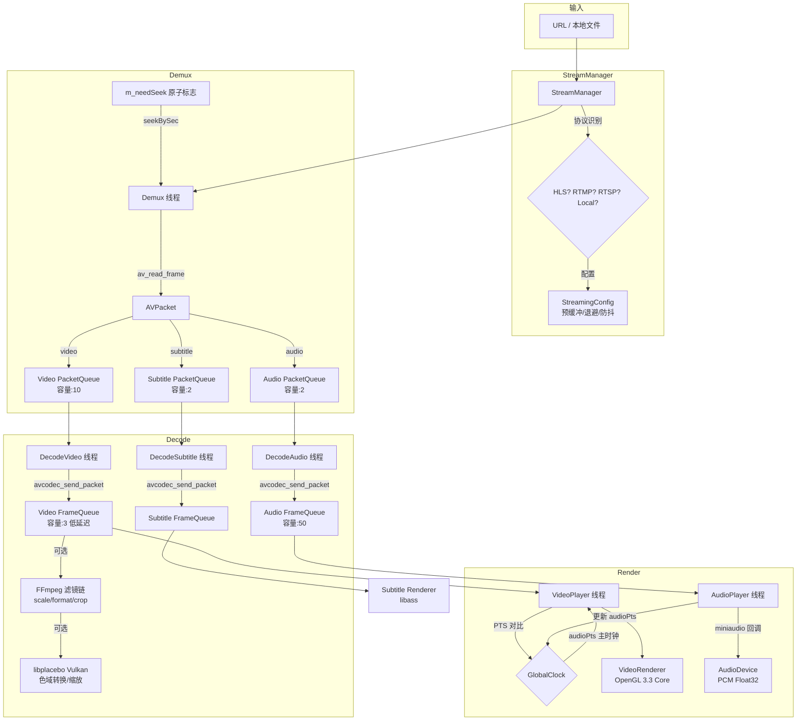
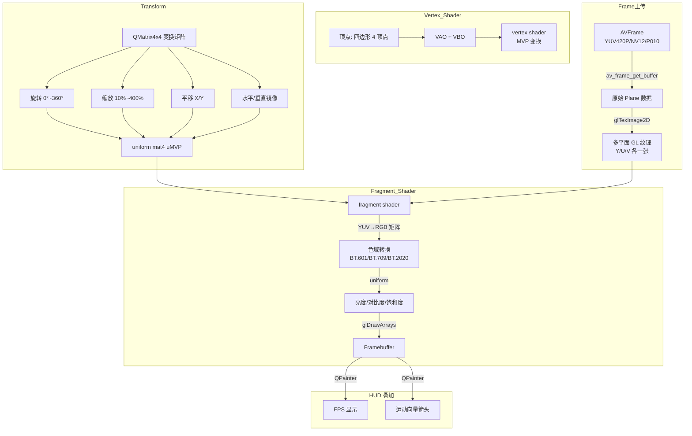
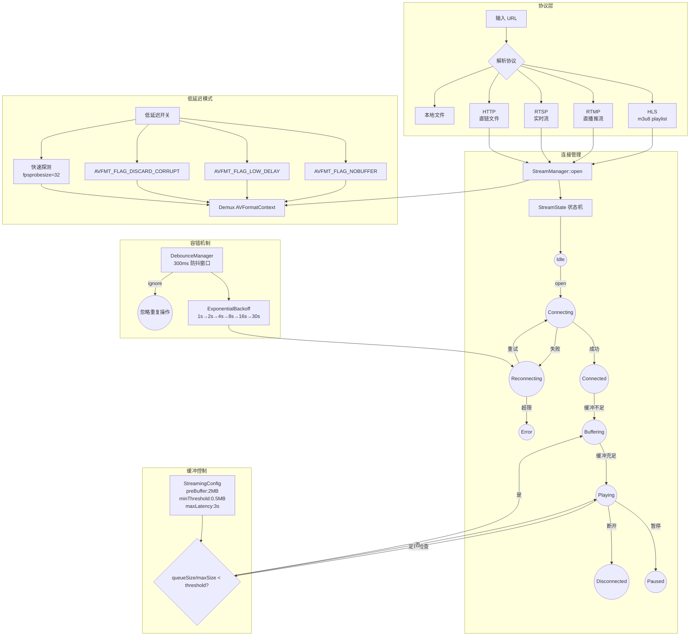

# RinzePlayer 核心架构图

## 一、解复用 → 解码 → 渲染管线

## 二、OpenGL 着色器与变换管线

## 三、流媒体处理管线

## 四、组件速查

| 组件 | 线程模型 | 输入 | 输出 |
|------|---------|------|------|
| Demux | `std::thread` 独立 | AVFormatContext URL | AVPacket ×3 队列 |
| DecodeVideo | `std::thread` 独立 | Video PacketQueue | AVFrame → Video FrameQueue |
| DecodeAudio | `std::thread` 独立 | Audio PacketQueue | AVFrame → Audio FrameQueue |
| DecodeSubtitle | `std::thread` 独立 | Subtitle PacketQueue | AVFrame → Subtitle FrameQueue |
| VideoPlayer | `std::thread` 独立 | Video FrameQueue | OpenGL Framebuffer |
| AudioPlayer | miniaudio 回调线程 | Audio FrameQueue | PCM Float32 → 设备 |
| StreamManager | QTimer + 回调 | QUrl | AVFormatContext |
| GlobalClock | 无(单例) | audioPts/videoPts | 主时钟 PTS |
